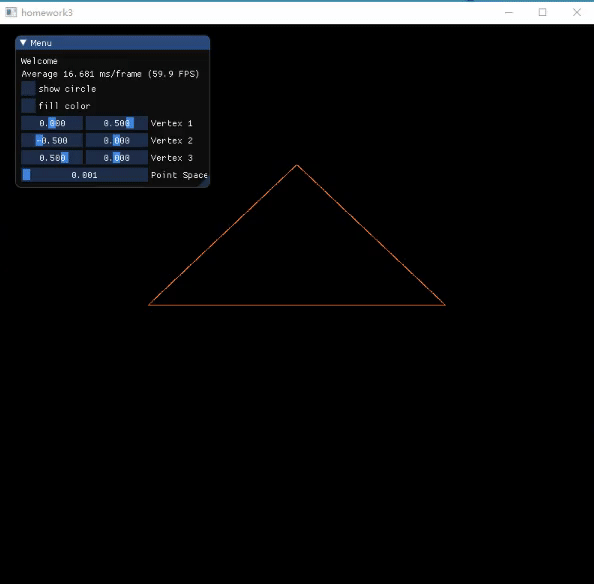

## 3 - Draw line
`jskyzero` `2018/03/27`

## Overview



注：
+ gif可能无法播放，请参考`./docs/output.gif`

## Install & Run

+ Please see the [PlayGround Example](https://github.com/jskyzero/Computer-Graphics/tree/master/projects/OpenGL-Playground)
+ Can both run in linux and windows
  1. Update the OpenGL library Path in `CMakeLists.txt`, please make sure this library structured like playground example.(it shoulld include glfw/glad/imgui)
  2. Run the fellow commands
    ```Bash
    mkdir build
    cd build
    cmake ..
    # linux
    make
    # windows
    MsBuild.exe homework2.sln
    ```
  3. run the output binary file
+ If there are questions or errors
  1. if run in windows have null function error, try to comment the funciton `glBindSampler()` in `src/imgui_impl_glfw_gl3.cpp`
  2. ...


  ## Structure
> 简要说明实现思路以及主要function/algorithm的解释

+ 实现思路
  + 将一个程序分为初始设置部分，顶点输入和着色器部分，循环渲染部分。
  + 对要求展现的多个图形完成这些部分
  + 加入UI，完成UI逻辑
+ 主要function/algorithm的解释
  + 画边框：采用`Bresenham`算法，直线可以分为几种情况分别处理，圆心可以只画1/8，其余利用对称性。
  + 填充：采用暴力的`Edge Equations`方法，遍历区域内的点判断是否处于图形内部，在windows下测试帧数极低，linux下大概20帧左右，可见这个方法还是复杂度很高的。
