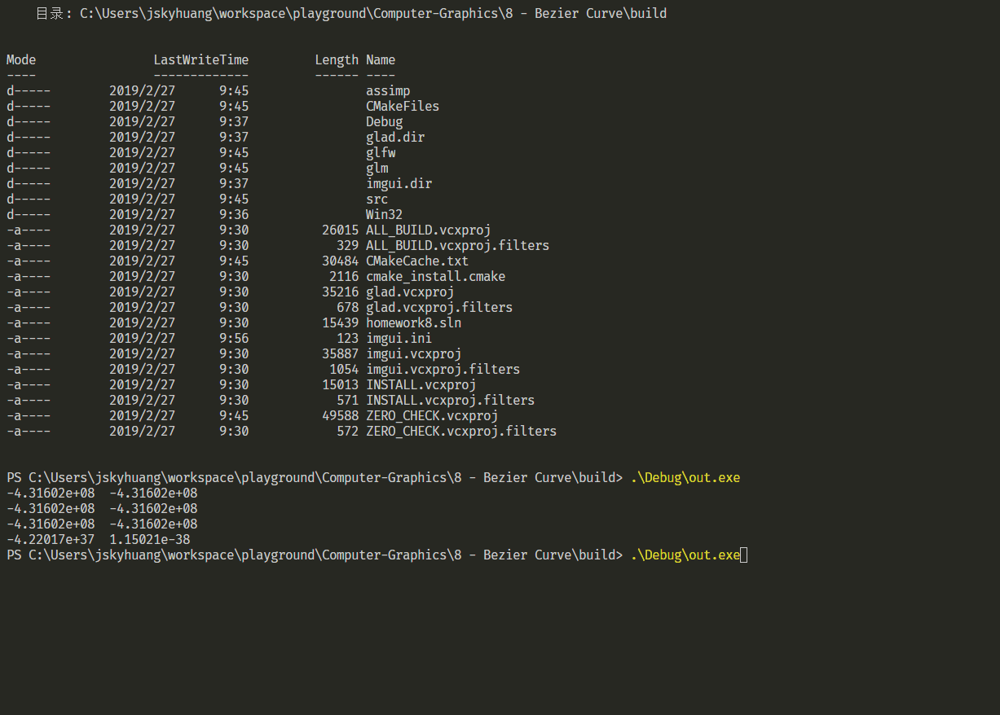

## 8 - Bezier Curve
`jskyzero` `2018/05/27`

## Overview


注：
+ gif可能无法播放，请参考`./docs/output.gif`或者`./docs/output.MP4`

## Install & Run

+ Please see the [PlayGround Example](https://github.com/jskyzero/Computer-Graphics/tree/master/projects/OpenGL-Playground)
  + Can both run in linux and windows
  + Run the fellow commands
  ```Bash
  mkdir build; cd build; cmake ..;
  # linux
  make
  # windows
  MsBuild.exe homework.sln
  ```
  + Run the output binary file
+ If there are questions or errors
  1. if run in windows have null function error, try to comment the funciton `glBindSampler()` in `src/imgui_impl_glfw_gl3.cpp`
  2. ...

## 实现思路

1. 捕捉鼠标点击事件，记录点击的点，然后套用公式生成其他的点。
2. 更改颜色使用shader传递参数，能够修改点的话加一个ImGUI就好。