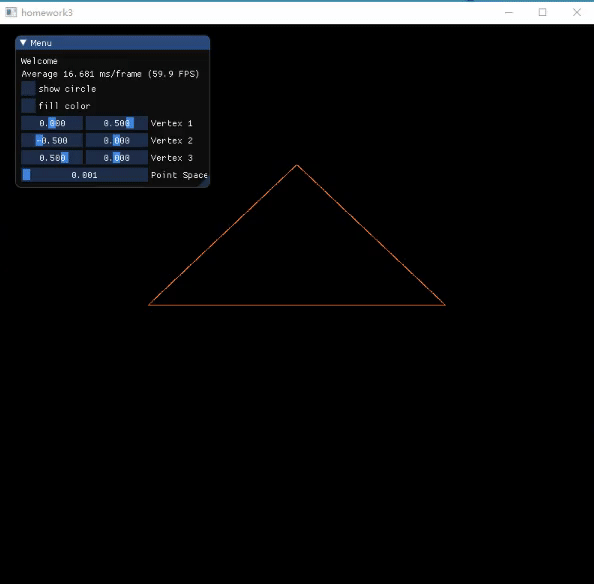

## 8 - Bezier Curve
`jskyzero` `2018/05/27`

## Overview

<!--  -->
注：
+ gif可能无法播放，请参考`./docs/output.gif`或者`./docs/output.MP4`

## Install & Run

+ Please see the [PlayGround Example](https://github.com/jskyzero/Computer-Graphics/tree/master/projects/OpenGL-Playground)
+ Can both run in linux and windows
  1. Update the OpenGL library Path in `CMakeLists.txt`, please make sure this library structured like playground example.(it shoulld include glfw/glad/imgui)
  2. Run the fellow commands
    ```Bash
    mkdir build
    cd build
    cmake ..
    # linux
    make
    # windows
    MsBuild.exe homework.sln
    ```
  3. run the output binary file
+ If there are questions or errors
  1. if run in windows have null function error, try to comment the funciton `glBindSampler()` in `src/imgui_impl_glfw_gl3.cpp`
  2. ...
